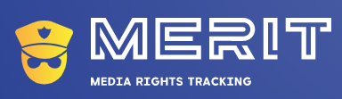
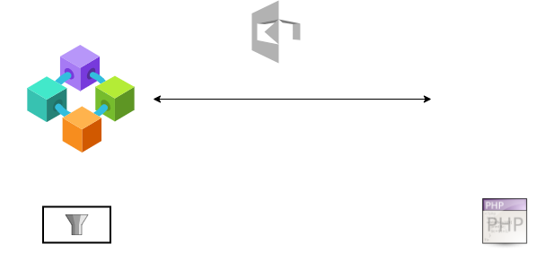
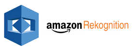
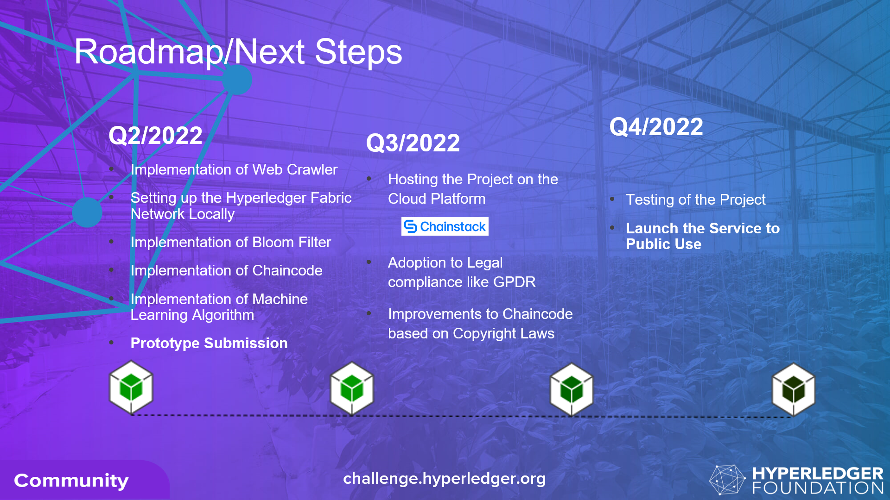

# MeRiT : Media Tracking Platform to Tackle Online Piracy 
   

  

 

### Project Name :  MeRiT : Media Tracking Platform to Tackle Online Piracy

#### Innovation Tagline : Distributed Ledger Powered Intelligent Crawler based Media Tracker for Copyright Infringement 

#### Project Keywords:	hyperledger-fabric, web-crawler, dark-web-crawler, piracy, digital-rights-management

### Authors

👤 **Swapneel Khandagale, M.Tech - 1st Year, TIFAC-CORE in Cyber Security, Amrita Vishwa Vidyapeetham**  

👤 **Ramaguru Radhakrishnan, Assistant Professor, TIFAC-CORE in Cyber Security, Amrita Vishwa Vidyapeetham**

### Project Description  

A Distributed Ledger System maintaining and monitoring the information on the copyrighted content provided by the legal owners. Such copyrighted content that could be accessed by our crawler to identify same or similar content on unauthorized websites. The crawler will index the URL and IP address of the platform hosting the content illegally. The system notifies the concerned owner of the copyright infringment, who verifies whether the content belongs to them. 

### Describe the solution	

Our solution combines web crawlers, deep web crawlers, a distributed ledger technology and machine learning to address the issue on media piracy. The ledger contributors are mainly the owners of the copyrighted content. According to their necessity, they can contribute a node to our blockchain and withdraw the node from the blockchain network.

The crawler searches the internet for any similar content or link to the content whose information has been immutably stored on the blockchain. If found, the information is indexed to our system. It sends out a notification to the copyright content owner, who then verifies it and approves forwarding the crawled information to law enforcement or any other agency responsible for taking down the content.

Existing solutions utilize crawlers just like our system. The novel approach we have taken is the employment of distributed ledger, which remove intermediaries, i.e., the system does not involve anyone else in the process other than the copyright owner. In our case, the content owner can be a part of the blockchain system and contribute to it. Law enforcement agencies and other agencies that can contribute by facilitating content removal are also part of our blockchain ecosystem.

Another key difference is that the existing service providers crawl the web only for the content they have been tasked to find on a contract basis. Our system lets the stakeholders manage the content database that they do not want to be infringed.

During the prototype phase, a web crawler and a distributed blockchain ledger based on Hyperledger Fabric can be set up with the facility to search for content that the crawler has found and suspects of being infringed.

 

#### Why is your solution better than existing/ state-of-the-art solutions?	

 - Most of the existing state-of-art solutions in handling piracy or digital rights realated to copyright does not employ crawlers for gathering the intelligence.   
 - Majority of them today are not considering Dark Web. 
 - Handful solutions are using Blockchain as their underlying database for digital-rights management, but this approach has just started. 
 
 Our solution combines 
 - Crawler for intelligence
 - Blockchain for immutiablity, Traceability, Transparency of the data 
 - Machine Learning to automatically detect and prevent piracy

#### Does your solution have any Environmental, Social or Governance impact?	

Yes, our solution would have social and Governance Impact.

- **Social and Economical** because today most of us generate enoromous amount of data like picutres, videos, social media posts which is subject to intellectual property rights. The present day social media platforms like YouTube, Instagram and Facebook are generating new Business and Economic model. Our system would help in identifyin media piracy which would impact all these social media content creators economically.

#### Did you socialise your project or interact with anyone in the community? What notes did they give? Please tag them

No, We have not discussed this with any of the Hyperledger Community members. We would like to do after Prototype Evaluation.

#### Project Plan:	What does project growth plan look like? What timelines are you looking at?	

#### Q2/2022
 - Implementation of Web Crawler (Surface and Dark Web)
 - Setting up the Hyperledger Fabric Network Locally 
 - Implementation of Bloom Filter
 - Implementation of Chaincode 
 - Implementation of AWS - Rekognition 
 - **Prototype Submission**

#### Q3/2022
 -  Hosting the Project on the Cloud Platform 
 -  Adoption to Legal compliance like GPDR
 -  Improvements to Chaincode based on Copyright Laws

#### Q4/2022
 - Testing of the Project
 - Launch the Service to Public Use

 

#### How do you plan industry adoption?	

 - MeRiT services shall be offered under different tiers
   - Free
   - Premium - Silver
   - Premium - Gold
   - Premium - Platinum
 - MeRiT would let users integrate their custom ledger to our system for secure tracking
 - MeRiT could be integrate to existing social media platform for automatic identification of infrige contents

#### How will the project be sustained? What are the skills that need to be hired?	

 - MeRiT will sustain because of the sheer need of Copyright management support to individuals without need to involve third-party and low-fee service
 - MeRiT could be integrate to existing social media platform for automatic identification of infrige contents

- **Skills Required**
  - Blockchain Developer
  - Full Stack Developer
  - Mobile Application Developer
  - Machine Learning Engineer
  - Digital Rights Management / Intellectual Property Rights Advocate

### Does the team agree to opensource it to Hyperledger Labs?	

Available in: [Hyperledger Labs](https://labs.hyperledger.org/labs/media-tracking-platform-to-tackle-online-piracy.html)

# SDG 

     
     
     

   
